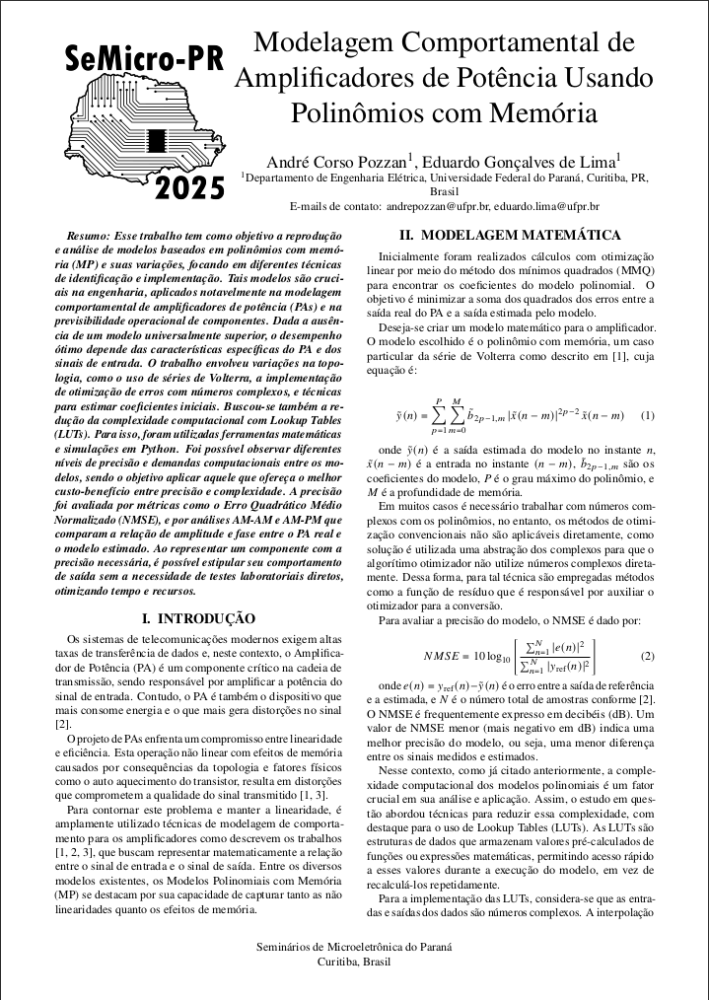
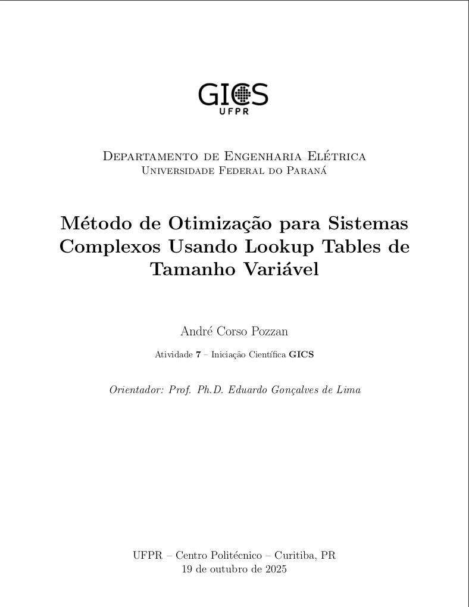

<p align="center">
  
  
  
</p>

# 📂 Repositório de Códigos da Iniciação Científica (GICS)

> Este repositório agrupa todos os scripts e implementações computacionais desenvolvidos ao longo da minha **Iniciação Científica** no grupo GICS. Aqui você encontrará códigos em Python e MATLAB, organizados de acordo com cada atividade/reporte técnico.

---

## 📖 Sobre

O **GICS** (Grupo de Concepção de Circuitos e Sistemas Integrados), vinculado à UFPR, tem como objetivo atuar na pesquisa e desenvolvimento de circuitos e sistemas integrados de **radiofrequência (RF)**, **analógicos**, **mistos** e **digitais**, contribuindo para o avanço científico da área e para a formação de recursos humanos altamente especializados.

Composto por professores com experiência internacional, o GICS desenvolve atividades nas seguintes áreas da **microeletrônica**:

- Projetos de circuitos integrados RF e analógicos
- Sistemas digitais e mistos
- Processamento de sinais
- Sistemas embarcados
- Identificação de sistemas não lineares

Este repositório foi criado para:

- **Armazenar** todos os códigos utilizados nos relatórios de Atividades da IC.
- **Facilitar** a reprodução dos experimentos e simulações.
- **Documentar** o uso de métodos de mínimos quadrados, séries de Volterra e modelos de Polinômio com Memória (MP).

---

## 🗂 Estrutura do Repositório

```text
.
├── assets
│   ├── ativ7.png
│   ├── gics-branco.png
│   ├── gics-logo.png
│   ├── logo-ufpr.svg
│   └── semicro.png
├── atividades
│   ├── 1-minimos-quadrados
│   │   ├── mmq-tabela.py
│   │   ├── mmq-tabela-saida.csv
│   │   ├── mmq-tabela-saida.txt
│   │   └── script.py
│   ├── 2-in-out-amplificador
│   │   ├── IN_OUT_PA.mat
│   │   └── script.py
│   ├── 3-modelo-mp
│   │   ├── in_out_SBRT2_direto.mat
│   │   ├── matriz.txt
│   │   └── script.py
│   ├── 4-modelo-nao-linear
│   │   ├── 3D-model.py
│   │   ├── IN_OUT_PA.mat
│   │   ├── script.py
│   │   └── terminal-out.txt
│   ├── 5-modelo-nao-linear-complexo
│   │   ├── 3D-model.py
│   │   ├── in_out_SBRT2_direto.mat
│   │   ├── script-3.py
│   │   ├── script-5.py
│   │   └── terminal-out.txt
│   ├── 6-luts-interpolacao-linear
│   │   ├── in_out_SBRT2_direto.mat
│   │   ├── script-6-lut.py
│   │   └── terminal-out.txt
│   └── 7-luts-tamanho-variavel
│       ├── in_out_SBRT2_direto.mat
│       ├── script-7-heatmap.py
│       ├── script-7-lut.py
│       └── terminal-out.txt
├── README.md
├── relatorios
│   ├── artigo-semicro2025-andrepozzan.pdf
│   ├── Atividade_1_IC_GICS.pdf
│   ├── Atividade_2_IC_GICS.pdf
│   ├── Atividade_3_IC_GICS.pdf
│   ├── Atividade_4_IC_GICS-andrepozzan.pdf
│   ├── Atividade_5_IC_GICS-andrepozzan.pdf
│   ├── Atividade_6_IC_GICS-andrepozzan.pdf
│   └── Atividade_7_IC_GICS-andrepozzan.pdf
└── requirements.txt

10 directories, 40 files
```

---

## ⚙️ Requisitos

Para rodar os scripts Python, é recomendado ter o ambiente virtual com os seguintes pacotes:

```bash
sudo apt update
sudo apt install python3-pip -y

pip install -r requirements.txt
```

---

## 🚀 Instalação & Uso

Clone este repositório e acesse a pasta desejada:

```bash
git clone https://github.com/andrepozzan/ic-gics.git
cd ic-gics/atividades/4-modelo-nao-linear
python3 script.py
```

---

## 📄 Relatórios Vinculados

Cada atividade possui um relatório de entrega, disponíveis para consulta na pasta "relatorios", a seguir segue uma pequena descrição contendo número e titulo de cada um.

- 📘 1 - Ajuste Linear via Mínimos Quadrados
- 📗 2 - Série de Volterra em Amplificadores
- 📙 3 - Modelo MP com sinais complexos
- 📕 4 - Modelo Matemático com Otimização Não Linear
- 📘 5 - Modelo Matemático com Otimização Não Linear e Números Complexos
- 📗 6 - Método de Otimização para Sistemas Complexos Usando Lookup Tables e Interpolação Linear
- 📙 7 - Método de Otimização para Sistemas
Complexos Usando Lookup Tables de
Tamanho Variável

---

## Publicação SeMicro-PR

Acesse: <a href="https://jpm.ufpr.br/">https://jpm.ufpr.br/</a>

O artigo completo está disponível em "relatorios/artigo-semicro2025-andrepozzan.pdf"

<p align="center">
  

### Último relatório realizado:

<p align="center">
  

## 👤 Autor

Desenvolvido por **André Corso Pozzan**  
Discente de Engenharia Elétrica - UFPR

---
