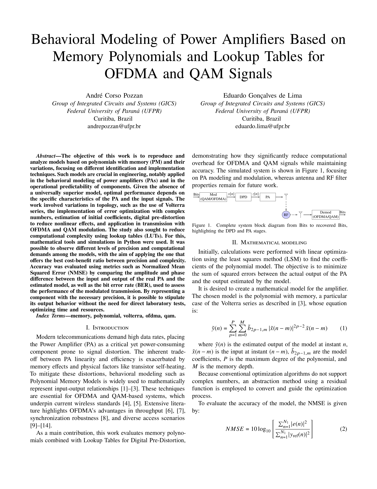
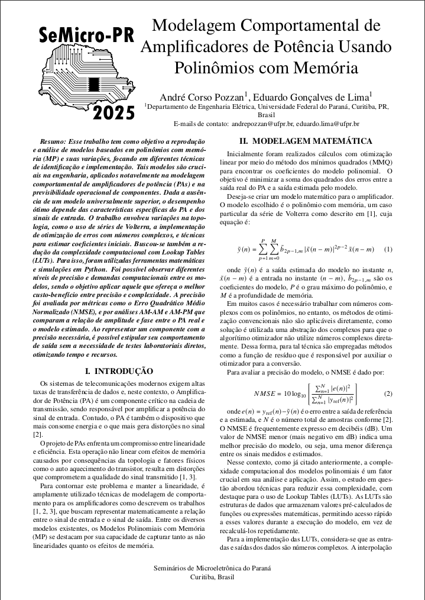
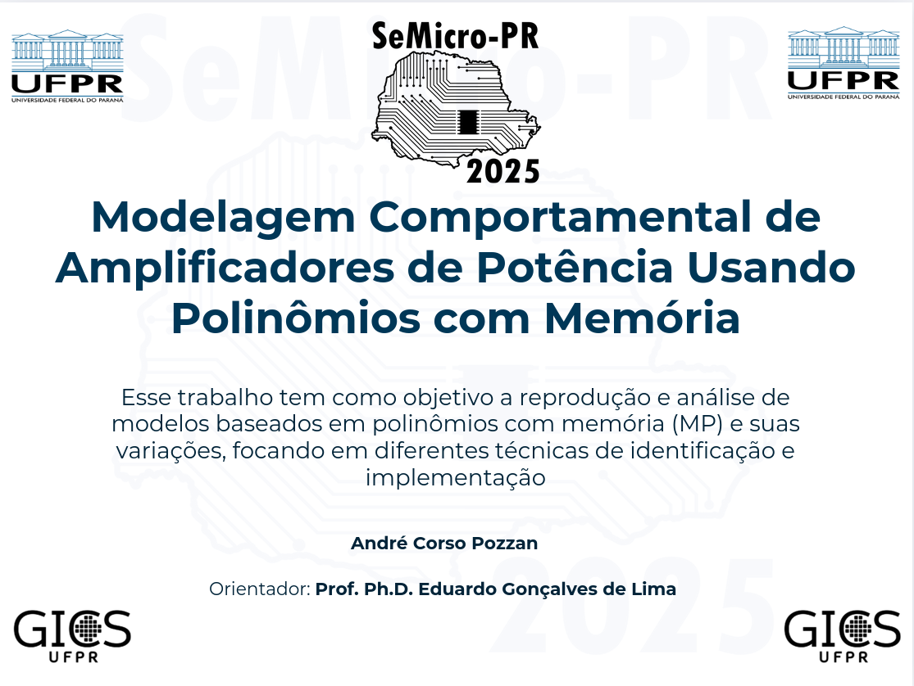
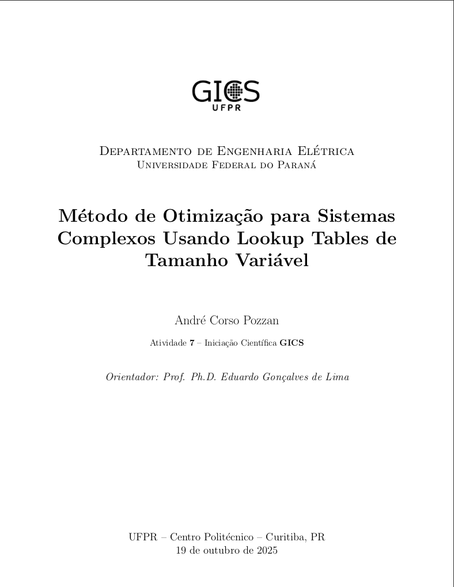

<p align="center">
  
  
  
</p>

# 📂 Repositório de Códigos da Iniciação Científica (GICS)

> Este repositório agrupa todos os scripts e implementações computacionais desenvolvidos ao longo da minha **Iniciação Científica** no grupo GICS. Aqui você encontrará códigos em Python e MATLAB, organizados de acordo com cada atividade/reporte técnico.

---

## 📖 Sobre

O **GICS** (Grupo de Concepção de Circuitos e Sistemas Integrados), vinculado à UFPR, tem como objetivo atuar na pesquisa e desenvolvimento de circuitos e sistemas integrados de **radiofrequência (RF)**, **analógicos**, **mistos** e **digitais**, contribuindo para o avanço científico da área e para a formação de recursos humanos altamente especializados.

Composto por professores com experiência internacional, o GICS desenvolve atividades nas seguintes áreas da **microeletrônica**:

- Projetos de circuitos integrados RF e analógicos
- Sistemas digitais e mistos
- Processamento de sinais
- Sistemas embarcados
- Identificação de sistemas não lineares

Este repositório foi criado para:

- **Armazenar** todos os códigos utilizados nos relatórios de Atividades da IC.
- **Facilitar** a reprodução dos experimentos e simulações.
- **Documentar** o uso de métodos de mínimos quadrados, séries de Volterra e modelos de Polinômio com Memória (MP).

---

## 🗂 Estrutura do Repositório

```text
.
├── assets
│   ├── artigo-emicro-sim-capa.png
│   ├── ativ7.png
│   ├── gics-branco.png
│   ├── gics-logo.png
│   ├── logo-ufpr.svg
│   ├── semicro.png
│   └── slides-semicro.png
├── atividades
│   ├── 1-minimos-quadrados
│   ├── 2-in-out-amplificador
│   ├── 3-modelo-mp
│   ├── 4-modelo-nao-linear
│   ├── 5-modelo-nao-linear-complexo
│   ├── 6-luts-interpolacao-linear
│   ├── 7-luts-tamanho-variavel
│   └── 8-pre-distorcao-com-ofdma
├── certificados
│   ├── EMICRO-SIM-2026-apresentacao.pdf
│   ├── EMICRO-SIM-2026-participacao.pdf
│   └── SeMicro2025certificado.pdf
├── README.md
├── relatorios
│   ├── 6A-24-Andre-Pozzan-Behavioral-Modeling-of-Power-Amplifiers-v2.pdf
│   ├── artigo-EMICRO_andrepozzan_v05.pdf
│   ├── artigo-semicro2025-andrepozzan2.pdf.pdf
│   ├── Atividade_1_IC_GICS.pdf
│   ├── Atividade_2_IC_GICS.pdf
│   ├── Atividade_3_IC_GICS.pdf
│   ├── Atividade_4_IC_GICS-andrepozzan.pdf
│   ├── Atividade_5_IC_GICS-andrepozzan.pdf
│   ├── Atividade_6_IC_GICS-andrepozzan.pdf
│   ├── Atividade_7_IC_GICS-andrepozzan.pdf
│   └── slides-SEMICRO-final-1.pdf
└── requirements.txt

12 directories, 23 files

```

---

## ⚙️ Requisitos

Para rodar os scripts Python, é recomendado ter o ambiente virtual com os seguintes pacotes:

```bash
sudo apt update
sudo apt install python3-pip -y

pip install -r requirements.txt
```

---

## 🚀 Instalação & Uso

Clone este repositório e acesse a pasta desejada:

```bash
git clone https://github.com/andrepozzan/ic-gics.git
cd ic-gics/atividades/4-modelo-nao-linear
python3 script.py
```

---

## 📄 Relatórios Vinculados

Cada atividade possui um relatório de entrega, disponíveis para consulta na pasta "relatorios", a seguir segue uma pequena descrição contendo número e titulo de cada um.

- 📘 1 - Ajuste Linear via Mínimos Quadrados
- 📗 2 - Série de Volterra em Amplificadores
- 📙 3 - Modelo MP com sinais complexos
- 📕 4 - Modelo Matemático com Otimização Não Linear
- 📘 5 - Modelo Matemático com Otimização Não Linear e Números Complexos
- 📗 6 - Método de Otimização para Sistemas Complexos Usando Lookup Tables e Interpolação Linear
- 📙 7 - Método de Otimização para Sistemas
  Complexos Usando Lookup Tables de
  Tamanho Variável

---
## Artigos publicados


### EMICRO SIM 2026

<a href="https://sites.google.com/view/emicro-sim-2026/programa%C3%A7%C3%A3o" target="_blank" rel="noopener noreferrer">
  EMicro | SIM 2026 - Programação (12/06 - Sessão 6A)
</a>


<a href="https://raw.githubusercontent.com/andrepozzan/ic-gics/main/relatorios/artigo-EMICRO_andrepozzan_v05.pdf">Artigo completo</a>
<p align="center">
  


### SeMicro-PR 2025

Acesse: <a href="https://jpm.ufpr.br/anais/#:~:text=Modelagem comportamental de amplificadores de potência usando polinômios com memória">JPM-Modelagem comportamental de amplificadores de potência usando polinômios com memória</a>

<a href="https://raw.githubusercontent.com/andrepozzan/ic-gics/main/relatorios/artigo-semicro2025-andrepozzan2.pdf.pdf">Artigo completo</a>
<p align="center">
  
<!-- <p align="center">
   -->


<!-- ### Último relatório realizado:

<p align="center">
   -->

## 👤 Autor

Desenvolvido por **André Corso Pozzan**  
Discente de Engenharia Elétrica - UFPR

---
